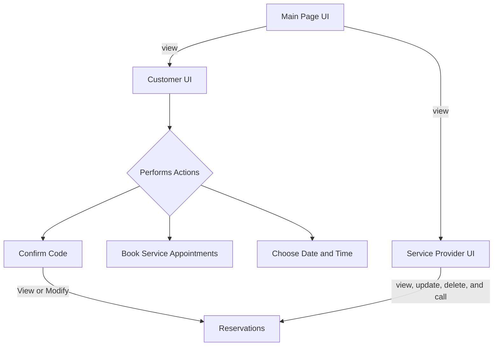

# Architecture

# Main page UI
 - All the user  can view all the general mechanic shop information and contents. Booking service web link can take user to Customer UI.

 # Customer page UI
  - Customer UI will support booking services. Customers will also need to fill the forums such as name, phone number, services that they want, and date and time. After then, it will generate confirm codes of reservations. With the reservation code, they can view and modify reservations. 

# Admin Page UI
 - This web page will only access for service providers. The service provider can update reservations, delete, and contact to customers. 

    

